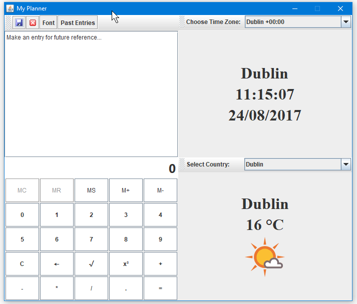

# Planner-Project
A planner I made in my free time using Java swing. The planner includes a way of making notes and saving the notes to be viewed in a separate window. It has a clock which can tell the time in several countries. It can display the current weather in various countries and it also has a calculator.

In order to scrape the weather information from the internet, I used an open source HTML parser called jsoup: https://jsoup.org/

I also used an open source font chooser for the notes called JFontChooser: http://jfontchooser.sourceforge.net/

